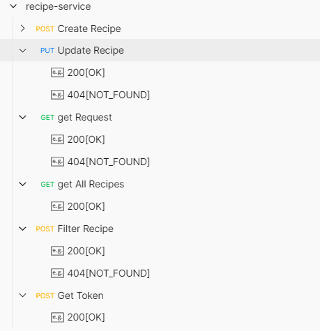
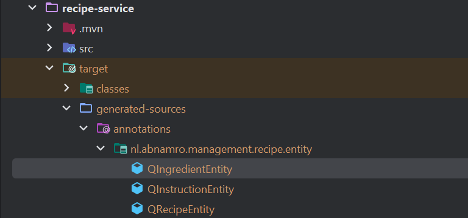

```
               _                                                                               _   
              (_)                                                                             | |  
 _ __ ___  ___ _ _ __   ___ ______ _ __ ___   __ _ _ __   __ _  __ _  ___ _ __ ___   ___ _ __ | |_ 
| '__/ _ \/ __| | '_ \ / _ \______| '_ ` _ \ / _` | '_ \ / _` |/ _` |/ _ \ '_ ` _ \ / _ \ '_ \| __|
| | |  __/ (__| | |_) |  __/      | | | | | | (_| | | | | (_| | (_| |  __/ | | | | |  __/ | | | |_ 
|_|  \___|\___|_| .__/ \___|      |_| |_| |_|\__,_|_| |_|\__,_|\__, |\___|_| |_| |_|\___|_| |_|\__|
                | |                                             __/ |                              
                |_|                                            |___/                               
```

<hr style="border:2px solid grey">


## _How to Build And Run_
  - Please check out the project from link 
```
 https://github.com/marknnb/recipe-management.git
```

  - Open command prompt in the root directory of project

  - if maven is not present on the system
  - Make sure Java 21 or higher version is on class path 
  - If not in intellij IDE please download java 21 and build project from there as well.
  - for bash
```
    ./mvnw -pl recipe-service spring-boot:build-image -DskipTests
```
- for windows CMD
```
    mvnw -pl recipe-service spring-boot:build-image -DskipTests
```
  - if maven is present on the system and mvn command is available in path please run
```
    mvn -pl recipe-service spring-boot:build-image -DskipTests
```

  - Running test cases will takes time , that's why test cases are disabled via "-DskipTests". If you want to run test
    cases and build the project then please remove "-DskipTests" option from maven command .
  - Please run the docker and go to the deployment folder under docker-compose please run following command
  - 
```
 docker compose -f infra.yml up -d
```


  - If the intellij/eclipse is present on the system run the project from run configuration.
  - if IDE is not present please run following command.
  - Application jar can be fond in the target folder of the project

```
java -jar recipe-service.1.0.0.jar

```


<hr style="border:2px solid grey">

## _How to Test_

 - Swagger URL `http://localhost:8090/swagger-ui/index.html#/`
 - Click on Authorise and provide following values and click openid scope:

```
Client ID: recipe-client
Client Secret: S1xETwMhcMIIDcXLyyoObhR9Q2kCP9GW

```


- you will get redirected to keycloak login page .Please provide following values into it

```
Username: abn-amro-user
Password: password

```


- after successfully log in , you will be redirected to swagger page 
- click on close page and now token will be added automatically in the request

- Test Using postman
- import postman collection into postman
- - 

```
     "grant_type": "password credentials",
     "client_id": "recipe-client",
     "client_secret": "S1xETwMhcMIIDcXLyyoObhR9Q2kCP9GW",
     "username": "abn-amro-user",
     "password": "password",
     "Access Token URL": "http://localhost:9191/realms/abn-amro-recipe-management/protocol/openid-connect/token"
```

- Add authorization in postman with following values
- Click on get token
- After successful retrieval of token postman call can be used to call the service
- You need to add Authorization for each request. When you will try to add Oauth2.0 authorization you can reuse existing set you did it for 
  previous endpoint
- in postman add success and failure scenarios examples are stored. Please refer those for sample output.



<hr style="border:2px solid grey">

## _Important Links_
  - swagger : `http://localhost:8090/swagger-ui/index.html#/`
  - add oAuth2.0 config in swagger : `http://localhost:9191/`
    - credentials to login can be found under /deployment/docker-compose/infra.yml
```

     KEYCLOAK_ADMIN=recipe_admin
     KEYCLOAK_ADMIN_PASSWORD=recipe_admin_password

```
<hr style="border:2px solid grey">

## _Project Test Cases_

 - Unit Test Cases
   - Mockito and Assertions
 - Integration Test Cases
   - Mockito
   - SpringIntegration Test
   - Test Containers for DB
   - Mocked Set up for OAuth2.0 tokens
 - End to End Integration Test
   - RestAssured
   - Test Containers 
   - Set up for Oauth2.0 using Keycloak test container
 - Use test suits to run these Unit Test , Integration and End-to-End tests
   - remove @Disables and run the test suit
   - Instead of running test cases manually for each class please use test suits 

<hr style="border:2px solid grey">

## _Project Tech Stack_

  - java 21
  - spring boot 3+
  - lombok
    - Lombok's annotations are used to reduce boilerplate code such as constructors and setters and getters 
  - postgres DB
  - Flyway migration
    - Flyway migration scripts are used to maintain DB schema
  - Query DSL 
    - If project is open in intellij sometimes intellij fail to add generated classes on class path.
    - Right click on generated package and add it to generated sources
    - 
  - keycloak for oAuth2.0 authentication
    - Keycloak container is used to set up oAuth2.0 in the application
  - openapi documentation
  - spotless maven plugin for automatic code reformat
    - please minimize documentation in controller class for better visibility
  - test containers
    - postgres and Keycloak containers are used for testing
  - docker
    - docker is used for setting up infrastructure 
    - docker is used for running End to End and Integration test cases
  - Junit5
  - postman

### Declaimer : All the OAuth Related configuration should come from vault like Azure vault as it contains secrets related to project.


## Future enhancements

- Authorizations for more controll over recipe-management
  - create roles based on the operation
  - add spring security to method or operation level
- Add Docker compose file which will use pushed image of recipe-service and infra.yml to run recipe management project in docker
- Add vault container to fetch secrets from Vault instead of configuration

<hr style="border:2px solid grey">
